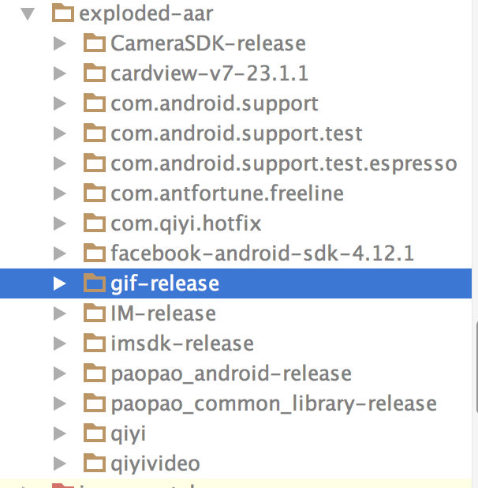

## Freeline编译原理

### 一原理
1. 多module下，子module的资源生产的id,会被合并在主工程（build/intermediates/symbols/XX/R.txt）
下，如果资源存在重复，在主工程通过R调用资源时，会默认使用主工程的资源；
但是，在子工程中，依然会生成自己build文件，同样，会生成相应的R文件，和子工程中分配的R文件id并不一致

2. 在第一次clean工程时，会hook编译流程，生产工程的设置文件
`freeline_project_description.json`
文件中会配置生成的缓存地址。

MergeDexTask

```python
def __init__(self, cache_dir, all_modules):
        Task.__init__(self, 'merge_dex_task')
        self._cache_dir = cache_dir
        self._all_modules = all_modules

    def execute(self):
        if is_src_changed(self._cache_dir):
            pending_merge_dexes = self._get_dexes()
            dex_path = get_incremental_dex_path(self._cache_dir)
            if len(pending_merge_dexes) == 1:
                self.debug('just 1 dex need to sync, copy {} to {}'.format(pending_merge_dexes[0], dex_path))
                shutil.copy(pending_merge_dexes[0], dex_path)
            elif len(pending_merge_dexes) > 1:
                dex_path = get_incremental_dex_path(self._cache_dir)
                dex_merge_args = ['java', '-jar', os.path.join('freeline', 'release-tools', 'DexMerge.jar'), dex_path]
                dex_merge_args.extend(pending_merge_dexes)
                self.debug('merge dex exec: ' + ' '.join(dex_merge_args))
                output, err, code = cexec(dex_merge_args, callback=None)
                if code != 0:
                    raise FreelineException('merge dex failed: {}'.format(' '.join(dex_merge_args)),
                                            output + '\n' + err)

    def _get_dexes(self):
        pending_merge_dexes = []
        target_dir = get_incremental_dex_dir(self._cache_dir)
        for module in self._all_modules:
            dir_path = os.path.join(self._cache_dir, module, 'dex')
            if os.path.isdir(dir_path):
                files = os.listdir(dir_path)
                dexes = [os.path.join(dir_path, fn) for fn in files if fn.endswith('.dex')]
                if len(dexes) == 1:
                    pending_merge_dexes.extend(dexes)
                else:
                    for dex in dexes:
                        if dex.endswith('classes.dex'):
                            shutil.copy(dex, os.path.join(target_dir, module + '-classes.dex'))
                        else:
                            pending_merge_dexes.append(dex)
        return pending_merge_dexes
```
1. 通过配置文件 `increment.srcflag` 判断是否有新增内容
2. 每个module，在存在文件修改后，执行整理编译时，会把新修改的文件单独生成dex，放置在`cache_dir/module/dex`目录下
3. 查找`freeline-dexes`目录是否存在，不存在，将新增dex目录；把所有modules下生成的class.dex copy至 `cache目录+freeline-dexes`
4. `java -jar freeline/release-tools/DexMerge.jar/dex_path` 命令，通过DexMerge.jar合并dex


### 二.生成exploded-aar
在对gradle同步之后，会生成`build/intermediates/exploded-aar`，该目录特点：
1.会对本module中以来的aar进行解析，解析java文件为class.jar,assets,libs,res等，相当于把aar中的内容以普通工程的形式展现出来，如果该module是顶层module，会把其依赖的modules以aar工程目录的形式全部展示

