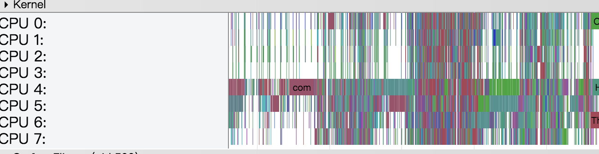

## 1.简介

互联网领域里有个八秒定律，如果网页打开时间超过8秒，便会有超过70%的用户放弃等待，对Android APP而言，要求更加严格，如果系统无响应时间超过5秒，便会出现ANR，APP可能会被强制关闭，因此，启动时间作为一个重要的性能指标，关系着用户的第一体验。

爱奇艺安卓APP非常重视启动速度的优化，本文将从启动过程，启动时间测量，启动优化，以及后续监控等方面分享我们在启动优化方面积累的经验。

## 2.启动模式
要准确的测量APP的启动时间，首先我们要了解APP整个启动过程。
启动过程，一般可以分为以下三类：

模式    |场景   |进程   |生命周期 |启动速度
-------|-------|------|--------|------
Hot    |最小化  |exist |onResume|非常快
Warm   |退出    |exist |onCreate->onStart->onResume|快
Cold   |杀死    |dead  |InitProcess->BindApplication->onCreate->onStart->onResume|慢

从上图可以看出，启动过程中，Cold的模式下，生命周期中做的事情最多，启动的时间最长，因此，我们以冷启动来衡量APP启动时间。那问题来了，启动过程中，如何判断哪些生命周期影响启动速度呢？

## 3.启动过程
我们知道，APP的启动和运行，就是Linux系统创建进程和组件对象，并在`UI线程`中处理组件消息的过程。

启动过程图:

App的启动过程，可以划分为三个阶段:
### 3.1 创建进程
当APP启动时，如果当前app的进程不存在，便会创建新的进程；App主进程启动后，如果启动某个组件，并且该组件设置了`android:process `属性，组件所运行的进程不存在，也会创建新的进程。  
`需要注意的是，如果在启动阶段，初始化的组件中，包含了多个进程，便会创建多次进程，BindApplication操作也会重复执行多次`

### 3.2 创建UI线程及Handler
进程创建后，会通过反射，执行ActivityThread入口函数,创建Handler，并在当前线程中`prepareMainLooper`,并在Handler中接收组件的消息，我们来看一下Handler中处理的消息：

消息                              |     场景  
----------------------------------|--------------------
LAUNCH_ACTIVITY(activityStart)    | 启动，执行Activity，onCreate,onStart,onResume
RELAUNCH_ACTIVITY(activityRestart)| 恢复App,onRestart
RESUME_ACTIVITY(activityResume)   | 恢复Activity,onResume
BIND_APPLICATION(bindApplication) | 启动，bindApplication
CREATE_SERVICE(serviceCreate)     | Service创建，onCreate
BIND_SERVICE(serviceBind)         | Service创建, onBind
SERVICE_ARGS(serviceStart)        | Service创建, onStart
LOW_MEMORY(lowMemory)             | 内存不足，回收后台程序
TRIM_MEMORY(trimMemory)           | 内存不足，回调
GC_WHEN_IDLE(GC)                  | 内存不足，GC
RECEIVER(broadcastReceiveComp)    | 接收广播
DUMP_HEAP(dump)                   | Dump Heap

sMainThreadHandler中，处理的消息很多，这里只罗列了，可能在启动阶段可能会执行的操作，
`这些操作都是运行在Main Thread中，对启动而言，属于阻塞性的。`  
Activity生命周期，自然需要在启动阶段执行，但，对于Service的创建，Trim_memory回调，广播接收等操作，就需要重点考虑，其操作耗时性。

### 3.3 Activity运行及绘制
前两个过程，创建进程和UI线程及Handler，都是由系统决定的，对APP开发者而言，并不能控制其执行时间，在本阶段，执行BindApplication,和Acitivity生命周期，都是可以由开发者自定义。  
Activity执行到onResume之后，会执行至ViewRootImpl，执行两次performTraversals,第二次traversal操作中，会执行performDraw操作，同时通知RenderThread线程执行绘制.

从启动的三个阶段，我们可以看出，启动启动时间的长短，决定因素在于，主线程中所做事情消耗的时间的多少，所以，我们的优化工作主要集中在，排查主线程中耗时性的工作，并进行合理的优化。可能有个疑问，既然如此，那我所有的初始化操作，全部放在异步线程去执行，这样并不会阻塞UI线程了，仅仅是理论上可行，在实际开发中，首先业务初始化前后是有依赖关系的，其次，Android手机，系统的资源是有限的，过多的异步线程，同样会抢占CPU，主线程执行时间片间隔增大。同样的，内存消耗状态，GC频率，也会影响启动的时间。

## 4.分析及测量
通过上述的源码的解读，我们已经了解了启动过程，以及可能引起启动过慢的原因。接下来介绍一些常用的分析手段及时间测量方法。
>启动分析工具，主要使用SysTrace，具体的使用方法，[请参考官网文档](https://developer.android.com/studio/profile/systrace.html)  

### 4.1 SysTrace分析技巧
#### 4.1.1 UI Thread 颜色显示

  

- 绿色：Running
- 白色：Sleeping
- 棕色：Uninterruptible Sleep
- 橙色：Uninterruptible Sleep - Block I/O

其中10ms以内的，较短时间的Sleeping状态，不用关注，可能是由于CPU调度的时间片分配间隔引起的；较长时间的Block I/O和Sleep状态，可以确定有阻塞启动的逻辑在这个阶段运行，需要进一步对代码进行分析定位。

#### 4.1.2 查看CPU状态及线程运行时长
查看CPU占用状态:

  

线程执行：

通过该阶段密集程度，反映出CPU占用率，也能在一定程度上反映出该阶段执行时间被阻塞情况；线程执行情况统计，可以查看线程执行时间排名，对执行时间较长的子线程进行优化。

### 4.2 SysTrace启动时间
这是通过SysTrace收集到的完成的启动的Trace图：

由图上可以看到，`UI Thread`中包含了`bindApplication`,`activityStart`,`traversal`等操作，`RenderThread`中包含`DrawFrame`等操作。这些TAG节点是源码已经添加的，可参考`#3.2`中介绍。

> Trace上启动时间：从bind至第二次traversal完成，可认为UI第一次绘制完成，启动完成。选中开始点和结束点，可以查看过程消耗的时间。

### 4.3 adb shell am start -W
在统计APP启动时间时，系统为我们提供了`adb`命令,可以输出启动时间  
源码：

>TotalTime: 表示新应用启动的耗时，包括新进程的启动和 Activity 的启动，但不包括前一个应用 Activity pause 的耗时

系统在绘制完成后，`ActivityManagerService `会回调该方法,统计时间不如SysTrace准确，但是能够方便我们通过脚本多次启动测量TotalTime,对比版本间启动时间差异。

### 4.4 埋点
通过APP启动生命周期中，关键位置加入时间点记录，达到测量目的。

### 4.5 录屏
录屏方式收集到的时间，更接近于用户的真实体感。

## 5.优化
在启动的过程中，为了让用户用户在进入APP之后，更快更流畅的使用服务，所以会在启动过程中，提前对一些基础库和组建进行初始化操作，这就意味着系统有限的资源会被抢占，影响启动时间。启动时间的优化，是一个平衡性能和体验的过程。

通过Systrace工具分析，我们发现爱奇艺爱奇艺安卓APP启动过程中一些问题，接下来，我们就结合具体的业务实践，进行启动问题进行优化。  

### 5.1 区分进程初始化Application
由`#3`我们了解到，对于一个app而言，App内组件可以运行在不同的进程之中。举个例子：
一个APP拥有主进程，插件进程，下载进程三个进程，会在启动阶段创建相应的组件，但只有一个QYApplication继承自系统Application，创建三次进程，QYApplication中attach(),onCreate()方法都会被执行三次。  
每个进程说需要初始化的内容肯定是不一样的，所以，为了防止资源的浪费，我们需要区分进程，初始化Appcation.

>成果：对多进程应用而言，通过对初始化内容进行梳理，合理区分初始化，会大幅减少内存和CPU占用。

### 5.2 异步处理耗时任务
子线程处理耗时任务，主线程做的事情越少，越早进入Acitivity绘制阶段，界面越早展现。  
注意：
- 不在主线程做耗时任务，如文件，网络等
- 启动阶段初始化任务，尽量在异步线程处理
- 主线程，不用等待或者依赖于子线程任务  

>进一步优化：可以自建线程池，维持一定线程个数，管理任务队列。

### 5.3 防止多线程抢占CPU
Android系统资源有限，特别是CPU资源，理论上来说，UI线程执行的任务，也无法保证一直被调度状态，当并发的线程数过多，UI线程时间片会更短，从而导致启动时间被变慢。  

下面罗列一些常见，容易造成CPU被抢占的场景：

场景      |执行时间       |执行频率       |策略
---------|---------------|-------------|----------------------
网络访问 |短              |高       |不重要的网络访问，降低线程优先级
Log日志  |短             |高       |Release包关掉日志开关，精简日志
大文件解析|长             |低        |文件分段解析，尽量不要在启动阶段操作
大SO库的加载|长           |低       |选择合适的时机加载

下面是以Log日志为例，在生命周期中打印多次，trace图如下：

从图中看出，高频率的日志，开启`logd.writer,log.reader.per`两个线程执行日志操作，抢占cpu严重。

>成果：通过对执行时间较久，执行频率的业务进行优化，将CPU占有率维持在合理的程度，会大幅减少启动时间，减少300ms以上。

### 5.4 系统API使用
部分系统的API使用是阻塞性的，文件很小可能无法感知，当文件过大，或者使用频繁时，可能造成阻塞。例如：
- `SharedPreference.Editor`提交操作：
  1. `commit`方法属于属于阻塞性质API，建议使用`apply`。
  2. 此外，我们知道，SP文件的存储是一个XML文件，以key-value形式存储，当业务过多时，需要拆分为多个文件存储，防止文件过大，出现读取耗时及ANR。
  3. 进一步优化，可对启动阶段，频繁的SP操作在内存中，统一提交。
- `AssetManager.open`操作：
  Android开发中，我们有时会将资源文件放在`assets`目录中，然后使用open操作读取文件，如果文件过大，需要在异步线程中执行。

>成果：随着业务量日积月累，正常的系统API的使用，也可能出现问题，通过排除，可减少50-100ms。

### 5.5 精简布局
布局的复杂程度，直接影响绘制的时间。  
启动阶段，背景图片`decodeBitmap`:

举个例子，在启动过程中，会有需要大的背景图，只有第一次安装时使用，后续属性设置为`android:visibility="gone"`,但是，虽然设置了`gone`属性，不会显示，但依旧会被解析。  

建议：
- 减少布局层次
- 无用资源使用ViewStub，使用时加载

>成果：启动阶段的布局较简单，通过优化背景图片的加载，减少50-100ms。

### 5.6 Service延后初始化
App启动中过程中，经常进行`Service`初始化操作，由于Service使用一般不涉及界面，可能会认为初始化生命周期不在主线程中，其实不然，在`3.2`的启动过程源码介绍中讲到，Service的生命周期，也属于主线程Handler接收的Message之一。  
Service启动中初始化SysTrace图：
 

建议：Service生命周期中，注意逻辑执行时间性能优化，初始化尽量延后。

>成果：取决于初始化Service的生命周期执行时间，可减少200ms以上。

### 5.7 将任务delay至首页绘制完成后
对于APP首页展示不需要的初始化逻辑，可延后至首页绘制完成后初始化。  
初始化Delay示例：

注意：
- 需要post两次才能保证在第一次绘制之后显示，因为，系统绘制会执行两次Performtraversal。
- 上述操作只能保证第一次绘制后执行，具体业务中，可能首页在多次绘制才能展现完全，需要特殊处理

进一步优化：可将业务逻辑的初始化划分为，首页绘制后，5s,10s,20s三个阶段分别初始化，防止首页绘制执行任务过多造成掉帧。

>成果：释放绘制阶段的CPU，可能绘制提前200ms以上。

## 6.监控
稳定的用户体验依赖于持续的监控，爱奇艺为监控启动性能建立了一套监控体系，测试，工具，开发等几个团队从不同的纬度搭建不同的监控方案

- 1.`测试`：录屏，从用户的真实体验角度，获取最准确的启动时间。
- 2.`实时监控`：通过埋点，大数据采样投递获取真实线上环境数据，从地域，时间，机型，app版本，系统版本等各个纬度对启动时间进行监控。
- 3.`脚本测试`：通过对脚本，对同一收集多次启动数据进行收集，通过不同版本间的对比，监控启动时间的变化情况。

## 7.SysTrace扩展

SysTrace通过TAG节点可以清晰展现，启动过程以及方法执行时间，但是，从发现问题，然后通过节点去定位问题，是一件很繁琐的工作，如果你们工程编译又比较慢，简直让人崩溃。

#### 7.1 自动化TAG注入
在Android工程编译的过程中，指定class，在方法前后，自动化插入Trace节点，统计方法执行时间。  
注入逻辑图：

流程：
- 1.在编译的过程中，插入自定义Task任务，
- 2.读取配置文件，文件中包含了需要注入`java文件名和路径名`和`method`
- 3.找到需要注入的class文件，然后通过ASM改变字节码，方法前后，插入自定义自定义方法  

通过工具的操作，能够做到不用修改原有工程文件，自动在打包时注入TAG节点和逻辑代码，配置文件可以循环利用，提高分析效率，节能环保。

## 8.优化结果
启动时间，由于不同的机型性能同，Android系统版本不同，同一APP版本启动时间，相差很大，所以统计一般以同一手机，不同版本做比较，尽量保证手机状态一致。  
SysTrace手机优化时间对比：

  
  

  

脚本多次启动时间收集对比：

  
  

经过多个版本的持续优化，有无广告两种不同的场景下，启动时间分别减少40%和35%，启动速度得到了大幅的提升。

## 9.总结
启动时间的优化和监控，是一项长期的任务，需要对异常的情况进行分析，对可能造成阻塞的代码逻辑进行合理的优化，非常感谢各个业务团队支持和配合。  
以上就是全部启动时间优化相关的内容，谢谢大家能够阅读到这里，如果有更好的建议，欢迎交流！

## 参考链接

- [启动过程链接](http://gityuan.com/2016/03/26/app-process-create/)
- [进程和线程](https://developer.android.com/guide/components/processes-and-threads.html)
