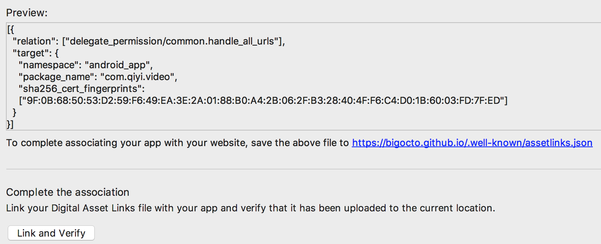

## 一. 简介

在Instant App开发中，需要app支持[Instant App Links](https://developer.android.com/training/app-links/index.html#app-links-vs-deep-links). 本文中，主要介绍其作用，配置必需条件，配置的过程。

## 二. 作用

App Links 本质上是 [Deep Link](https://developer.android.com/training/app-links/deep-linking.html) 的一种延伸，我们知道，Deep Link配置在Manifest之后，通过URL打开APP，会提示:


而通过App Links会直接打开APP,免去了提示的过程。

Deep Link 和 APP Links的区别：


## 三. 配置过程

这里要提一个工具，**App Links Assistant**,在Android studio 的tools目录下可以打开，这个工具可以帮助我们快速配置Android App Links，并能生成相应的json文件。相应的[官方文档](https://developer.android.com/studio/write/app-link-indexing.html)

#### 1. 生成Manifest URL Intent-filter

``` xml

<intent-filter android:autoVerify="true">
    <action android:name="android.intent.action.VIEW" />
    <category android:name="android.intent.category.DEFAULT" />
    <category android:name="android.intent.category.BROWSABLE" />

    <data
        android:scheme="https"
        android:host="bigocto.github.io" />
</intent-filter>

```
> 这里需要注意,官方文档中说明，支持定义多个域名指向同一个APP,在Manifest中配置不同的URL，在不同的域名配置json文件，但是，定义多个URL的<intent-filter>，只有每个配置在域名上的json文件都配置成功，APP端测试才能全部生效，有一个URL在域名未配置成功，及时其他的域名配置已成功，APP端测试也会显示全部不生效。


### 2. 生成 assetLinks.json文件

在App Links Assistant下，使用 **associate website**  功能：

#### 2.1 配置 **Domain**, **Application ID**:


> 注意，**Debug**, **Release** 模式下生成的**assetLinks.json**文件，相对应的，只能在相应**Debug**, **Release** 模式上下生成的APK进行调试，模式不同，会无法识别。

#### 2.2 生成 assetLinks.json :



#### 2.3 将生成的 assetLinks.json 配置网站上:

配置的地址：Https://**Domin**/.well-known/assetlinks.json

在github上可以测试，使用直接的github.io域名，将文件配置在该目录下：


>配置文件，必须配置在Host地址的 /.well-known/目录下，并且，必须支持**HTTPS**

#### 2.4 测试配置是否生效:
配置完成后，会有一小段时间的延迟，可以先通过打开文件地址：
Https://**Domin**/.well-known/assetlinks.json


然后，再使用App Links Assistant， 或者 [官方测试网站](https://developers.google.com/digital-asset-links/tools/generator)

网站测试结果：


## 四.判断是否生效

安装打包成的APK后，可使用命令：

adb shell am start -a android.intent.action.VIEW -c android.intent.category.BROWSABLE -d "https://bigocto.github.io/path/"

结果如下：

- 直接启动APP，配置成功。  

- 显示dialog，选择打开的程序，说明<intent-filter>配置成功，但网站配置的json，未生效

- 直接打开浏览器，进入相应的网站，说明<intent-filter>配置未匹配地址。
