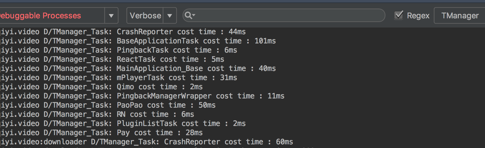
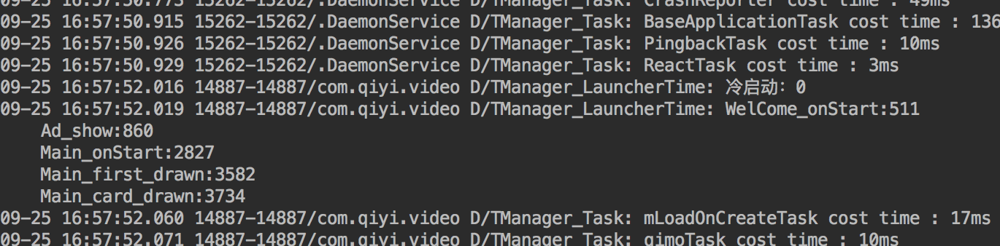

### 1.背景
顾名思义，TaskManager是一个任务管理器，目前主要对启动阶段任务进行管理。启动阶段初始化的任务有以下几个特点，

* 1.涉及业务类型多，初始化任务多，任务初始化时间无法监控
* 2.分为多个启动阶段，按生命周期可划分为BindApplication,WelcomeActivity,MainActivity三个阶段，任务初始化时机不确定；
* 3.对性能要求高，如果任务不被合理分配，同一时间初始化化，会严重抢占CPU和主线程时间，拖慢启动速度

针对这些特点，设计TaskManager,将任务封装为Task，统一交给TaskManager管理执行，TaskManager可以计算该任务执行时间，可通过配置执行时机，将任务在满足该时机时运行。


### 2. 使用
主要的执行模式有，1.直接执行，2.加入任务队列

#### 2.1. 封装为Task
``` java
Task pluginListTask = new Task("PluginListTask") {
    @Override
    public TaskResult doTask() {
        PluginController.getInstance().init(application);  // 插件列表数据
        return TaskResult.SUCCESS;
    }
};
```
#### 2.2. 直接执行
如果任务不需要进行调度，只用到TaskManager的统计时间的功能，可执行执行。
```java
TaskManager.getInstance().executeDirect(pluginListTask);
```

#### 2.3. 加入任务队列
加入任务队列的方式，设置任务触发的时机。以插件初始化为例，配置了多个可执行条件，任意一条件满足时，即触发该任务的执行。如果有需要，可以自行增加触发条件，并在合适位置触发该条件。

```java
Permits permits = new Permits.Builder()
         .setRequiresAdIsShow(true)//广告阶段可执行
         .setRequiresMainCardIsShow(true)//首页展现可执行
         .setRequiresFirstActivity(true)//第一个activity非WelcomeActivity时执行
         .setRequiresWindowForeground(true) //APP进入后台时执行
         .build();
 TaskRequest taskRequest = new TaskRequest.Builder(pluginListTask)
         .setPermits(permits)
         .setRunningThread(RunningThread.UI_THREAD)//执行在UI线程
         .build();
 TaskManager.getInstance().enqueue(taskRequest);
```
目前已有的Permits条件有：
```java
/**
  * 过滤条件，是否是应用处于后台时操作
  *
  * @param requiresWindowForeground 应用是否处于后台
  */
 public Builder setRequiresWindowForeground(boolean requiresWindowForeground) {
     this.mRequiresWindowForeground = requiresWindowForeground;
     return this;
 }

 /**
  * 过滤条件，是否处于广告播放阶段
  *
  * @param requiresAdPlay 广告渲染后
  */
 public Builder setRequiresAdIsShow(boolean requiresAdPlay) {
     this.mRequiresAdIsShow = requiresAdPlay;
     return this;
 }

 /**
  * 过滤条件，是否需要首页Card已绘制
  *
  * @param requiresMainCardIsShow 首页card绘制后
  */
 public Builder setRequiresMainCardIsShow(boolean requiresMainCardIsShow) {
     this.mRequiresMainCardShow = requiresMainCardIsShow;
     return this;
 }

 /**
  * 过滤条件，是否需要在welcome阶段执行
  * 有广告执行在广告阶段；无广告执行在WelcomeActivity生命周期中
  *
  * @param requiresWelcomeActivity 是否welcome阶段
  */
 public Builder setRequiresWelcomeActivity(boolean requiresWelcomeActivity) {
     this.mRequiresWelcomeActivity = requiresWelcomeActivity;
     return this;
 }

 /**
  * 过滤条件，是否需要在Application delay 2s后执行
  *
  * @param requiresApplicationDelay 是否delay后执行
  */
 public Builder setRequiresApplicationDelay(boolean requiresApplicationDelay) {
     this.mRequiresApplicationDelay = requiresApplicationDelay;
     return this;
 }

 /**
  * 过滤条件，是否需要在第一个Activity非Welcome时，执行一些操作
  * 适用于三方拉起
  *
  * @param requiresFirstActivity 是需要非Welcome时执行
  */
 public Builder setRequiresFirstActivity(boolean requiresFirstActivity) {
     this.mRequiresFirstActivity = requiresFirstActivity;
     return this;
 }
```
添加任务的位置，如原先在BindApplication里初始化的任务，需要调度，也可以在原位置添加到队列中，并不会被立即执行。触发时机的原则是，如果添加任务到队列时，如果该任务关注的触发条件**已触发**状态，该任务立即执行；如果**未触发**，则将该任务缓存，在任一条件满足时执行。

### 3.测试
#### 3.1 检查任务是否执行
在DebugLog开启的情况下，通过设置**TManager**标签，日志会输出任务的执行情况。


#### 3.2 任务耗时
**TManager** 标签，Log里会直接输出任务在UI线程的耗时，但是，对于子线程执行时间比较长的任务，我们衡量其耗时，通过关闭该任务执行，对比前后启动时间。简便方法：  

在手机sdcard目录下放置该文件，“/sdcard/TaskTest.json”，name代表不执行的任务名称
```json
{
   "list_task":[
      {
         "name":"Player"
      },
      {
        "name":"PaoPao"
      }
   ]
}
```
打开DebuLog中的测试开关：
```java
  /**
   * 启动时间测试开关
   */
  private final static boolean isLaunchTestMode = true;
```
可查看日志中，输出的不同阶段执行时间：


#### 4.总结
如有问题，可联系我，zhangyu@qiyi.com
